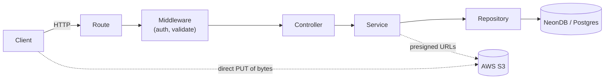
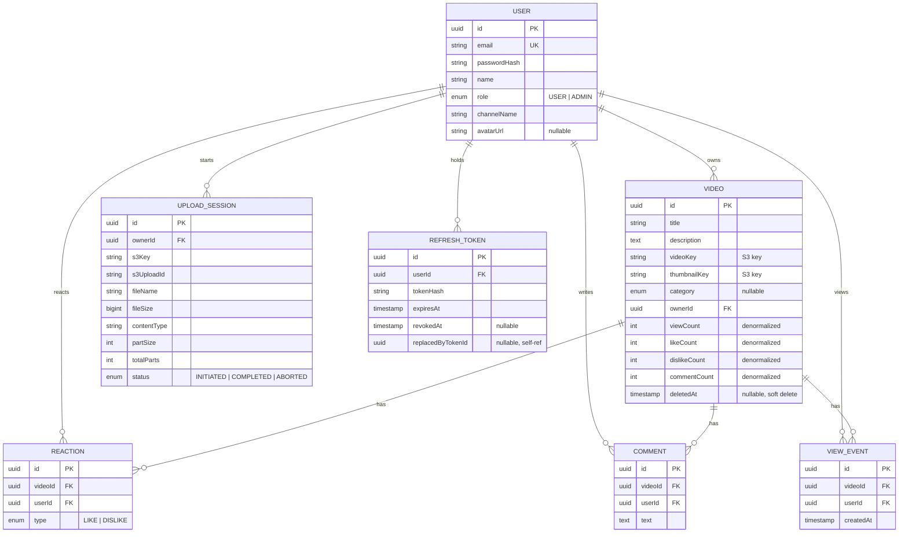
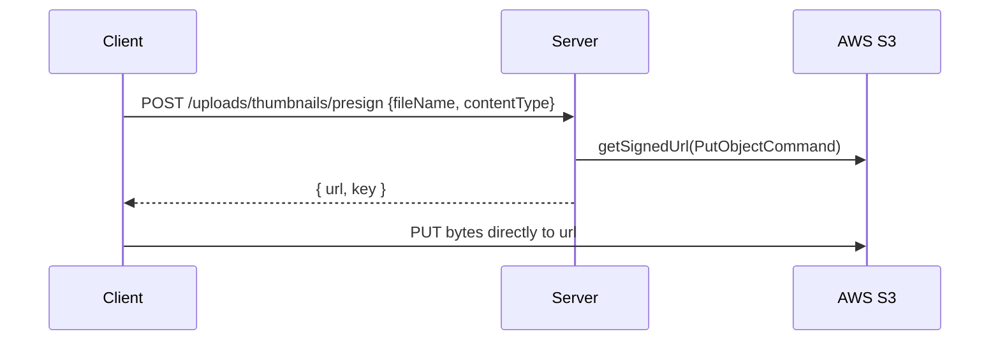
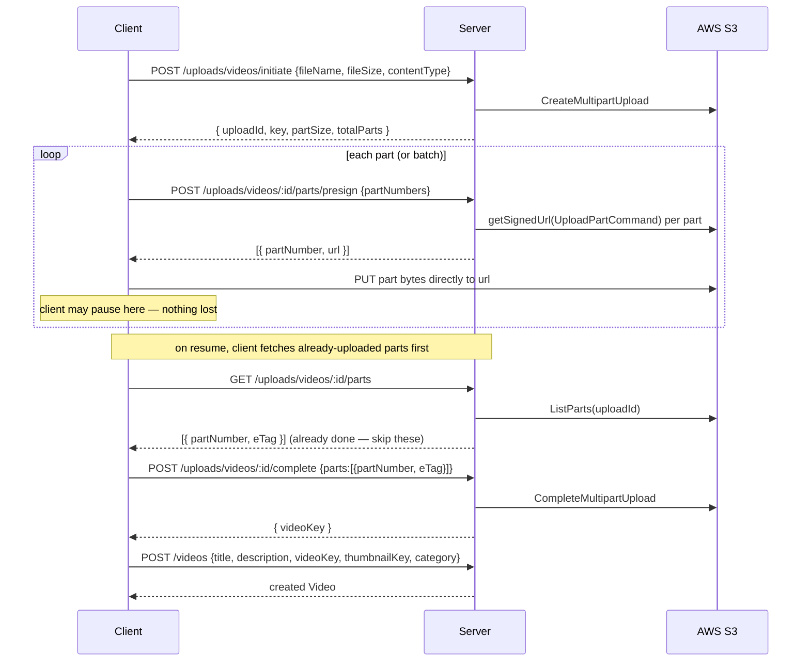

# Architecture — YT Server

This document is the binding technical contract for this repo. If code and this document disagree,
that's a bug in one of them — fix the drift, don't silently pick one. Pair with `PRD.md` (the
*what*); this document is the *how*.

## 1. Tech Stack

| Concern | Choice | Notes |
|---|---|---|
| Runtime | Node.js (LTS) + TypeScript | TypeORM's decorators and typing benefit heavily from TS. |
| HTTP framework | Express | Simplest fit for a routes→controller→service→repo layering. |
| ORM | TypeORM | `DataSource` + repository pattern. Prefer built-in `Repository`/`QueryBuilder` methods over raw SQL. |
| DB | PostgreSQL via NeonDB (serverless) | Use Neon's **pooled** connection string (`-pooler` host) for the app's runtime pool; migrations can use the direct (non-pooled) connection. |
| Validation | Joi | One schema module per resource; validated in middleware, before controllers run. |
| Auth | JWT (access + refresh), bcrypt for password hashing | Refresh tokens persisted hashed, rotated, revocable. |
| Object storage | AWS S3 (`@aws-sdk/client-s3`, `@aws-sdk/s3-request-presigner`) | Server never proxies file bytes — presigned URLs only. |
| Logging | `pino` (or equivalent structured logger) | JSON logs; request-id correlation. |

## 2. High-Level Flow



The client uploads video/thumbnail bytes **directly to S3** using presigned URLs the server hands
out — those bytes never transit through this server.

## 3. Layering Rules (non-negotiable)

**Route → Controller → Service → Repository → DB.** Each layer only talks to the layer directly
below it.

- **Route** (`src/routes/*.routes.ts`): wires an HTTP method + path to a Joi validation middleware
  + a controller method. No logic here beyond composing middleware.
- **Controller** (`src/controllers/*.controller.ts`): reads `req`, calls **one** service method,
  shapes the HTTP response via the shared response envelope (§6). No DB access, no business rules,
  no direct S3 calls here.
- **Service** (`src/services/*.service.ts`): all business logic — orchestration, authorization
  decisions beyond simple role checks, calling one or more repositories, calling S3 (via a thin
  `s3.util.ts`), computing derived data (e.g. recommendation ordering, views-by-day bucketing).
  Services can call other services, never other repositories' internals directly bypassing their
  owning service where cross-entity rules apply — but **may** call multiple repositories directly
  when simply reading/writing plain entity data (no cross-entity business rule involved).
- **Repository** (`src/repositories/*.repository.ts`): **all** DB access lives here, nowhere else.
  One repository file per entity — `UserRepository` only queries `User`, `VideoRepository` only
  queries `Video`, etc. Prefer TypeORM's built-in `Repository<T>` methods (`find`, `findOne`,
  `save`, `update`, `softDelete`, `increment`, etc.) and `QueryBuilder` only when built-ins can't
  express the query (e.g. the views-by-day `GROUP BY date`).

A repository must never be imported by a controller or route. A controller must never import a
repository or the TypeORM `DataSource` directly.

## 4. Folder Structure

```
src/
  config/
    env.ts                # parsed & validated process.env (fail fast on boot if missing)
    data-source.ts         # TypeORM DataSource (NeonDB connection)
    s3.ts                  # S3 client instance
    openapi.ts              # loads docs/openapi.yaml once at boot, served at /openapi.json
  entities/
    User.entity.ts
    Video.entity.ts
    UploadSession.entity.ts
    Reaction.entity.ts
    Comment.entity.ts
    ViewEvent.entity.ts
    RefreshToken.entity.ts
  repositories/
    user.repository.ts
    video.repository.ts
    upload-session.repository.ts
    reaction.repository.ts
    comment.repository.ts
    view-event.repository.ts
    refresh-token.repository.ts
  services/
    auth.service.ts
    user.service.ts
    video.service.ts
    upload.service.ts
    reaction.service.ts
    comment.service.ts
    admin.service.ts
  controllers/
    auth.controller.ts
    user.controller.ts
    video.controller.ts
    upload.controller.ts
    comment.controller.ts
    admin.controller.ts
  routes/
    auth.routes.ts
    user.routes.ts
    video.routes.ts
    upload.routes.ts
    comment.routes.ts
    admin.routes.ts
    index.ts              # mounts all routers under /api/v1
  middlewares/
    authenticate.ts        # verifies access token, attaches req.user
    authorize.ts            # role gate, e.g. authorize('ADMIN')
    validate.ts              # Joi schema-driven request validator
    error-handler.ts          # centralized error-to-response translator (last middleware)
  validations/
    auth.validation.ts
    video.validation.ts
    upload.validation.ts
    comment.validation.ts
    admin.validation.ts
  utils/
    ApiError.ts             # typed application error (statusCode + code + message)
    ApiResponse.ts          # success envelope helper
    asyncHandler.ts          # wraps async controllers, forwards rejections to error-handler
    errorCodes.ts             # central registry, §9
    jwt.util.ts
    password.util.ts
    s3.util.ts               # presign / multipart helpers, thin wrapper over AWS SDK
    pagination.util.ts
  jobs/
    seedAdmin.ts             # one-time bootstrap admin creation script
  migrations/
    <timestamp>-Init.ts
  app.ts                    # express app, middleware wiring
  server.ts                  # boot: load env, init DataSource, app.listen
```

## 5. Data Model

All entities use TypeORM decorators. `id` columns are UUID (`@PrimaryGeneratedColumn('uuid')`).
All entities get `createdAt`/`updatedAt` via `@CreateDateColumn`/`@UpdateDateColumn`.



Constraints worth calling out explicitly:
- `REACTION`: unique index on `(videoId, userId)` — one active reaction per user per video.
- `VIEW_EVENT`: index on `(videoId, createdAt)` for the views-by-day aggregation; index on
  `(videoId, userId, createdAt)` to support the 24h-dedupe check (PRD A5).
- `VIDEO`: index on `deletedAt` (or a partial index `WHERE deletedAt IS NULL`) since every listing
  query filters it out.
- `UPLOAD_SESSION.s3UploadId` is the AWS multipart `UploadId`, distinct from our own primary key.

## 6. API Conventions

- Base path: `/api/v1`.
- **Success envelope:**
  ```json
  { "success": true, "data": { }, "meta": { "page": 1, "limit": 20, "total": 134, "totalPages": 7 } }
  ```
  `meta` only present on paginated list endpoints.
- **Error envelope:**
  ```json
  {
    "success": false,
    "error": {
      "code": "VIDEO_NOT_FOUND",
      "message": "We couldn't find that video. It may have been removed.",
      "details": [{ "field": "title", "message": "\"title\" is required" }]
    }
  }
  ```
  `details` only present for `VALIDATION_ERROR`.
- **Pagination:** query params `page` (default 1), `limit` (default 20, max 100).
- Auth: `Authorization: Bearer <accessToken>` header on every protected route.
- **Live docs:** `GET /docs` serves an interactive [Scalar](https://scalar.com) reference generated
  from [`docs/openapi.yaml`](../docs/openapi.yaml) (also served raw at `/openapi.json`). The spec is
  hand-maintained — when a route's validation or response shape changes, update the YAML in the same
  change.

## 7. Upload Flow (S3 Presigned, Resumable Multipart)

### Thumbnail (single PUT)


### Video (resumable multipart)


Implementation notes:
- Part size: pick a fixed size (default 8 MB) respecting S3's 5 MB minimum part size (except the
  last part) and 10,000-part maximum. `initiate` computes `totalParts` from `fileSize`/`partSize`
  and rejects files that would exceed either the part cap or `MAX_VIDEO_SIZE_MB`.
- Every upload endpoint checks the `UploadSession.ownerId` against `req.user.id` — you can only
  drive your own upload session.
- `abort` must be callable idempotently and should also be invoked by a cleanup job for stale
  `INITIATED` sessions older than e.g. 24h (out of scope to build the job now, but design allows it).
- Pause/resume needs **no server-side state beyond what `ListParts` already gives us** — the client
  is the source of truth for "which parts do I still need to send," confirmed against S3 via
  `GET /uploads/videos/:id/parts`.

## 8. Auth & Token Strategy

- **Login:** verify `email` + bcrypt-compare `password` → issue access token (JWT, ~15 min expiry)
  + refresh token (JWT or opaque random string, ~7-30 day expiry, configurable).
- **Refresh token storage:** never store the raw refresh token. Store `sha256(token)` in
  `RefreshToken.tokenHash`. On `/auth/refresh`:
  1. Hash the incoming token, look it up.
  2. If not found → `401 AUTH_REFRESH_TOKEN_INVALID`.
  3. If found but `revokedAt` set → **reuse detected**: revoke all refresh tokens for that
     `userId`, return `401 AUTH_REFRESH_TOKEN_REUSED` (forces full re-login; mitigates a stolen
     token being replayed after the legitimate client already rotated it).
  4. If found, valid, unexpired → revoke it, issue a new access+refresh pair, set
     `replacedByTokenId` on the old row.
- **Logout:** revoke the given refresh token's row.
- **Authorization middleware:** `authenticate` verifies the access token and loads `req.user`
  (`id`, `role`); `authorize('ADMIN')` gates admin-only routes. Role checks belong in this
  middleware layer, not scattered through services.

## 9. Centralized Error Handling

- `ApiError` (in `utils/ApiError.ts`): `{ statusCode: number, code: string, message: string, details?: FieldError[] }`,
  thrown from anywhere in services/controllers.
- `asyncHandler` wraps every controller so a thrown/rejected error reaches Express's error pipeline
  without a manual `try/catch` in every controller.
- `error-handler.ts` middleware (registered last in `app.ts`) is the **only** place that turns an
  error into an HTTP response. It:
  - Passes `ApiError` instances straight through to the error envelope.
  - Maps Joi validation errors to `400 VALIDATION_ERROR` with a `details` array.
  - Maps TypeORM known errors (e.g. unique constraint violation) to an appropriate `ApiError`
    (e.g. `409 DUPLICATE_EMAIL`).
  - Falls back to `500 INTERNAL_SERVER_ERROR` for anything unrecognized, logging the real error
    server-side but returning a generic, non-leaky message to the client.

**Error code registry** (`utils/errorCodes.ts` is the source of truth; keep this table in sync):

| Code | HTTP | Meaning |
|---|---|---|
| `VALIDATION_ERROR` | 400 | Request failed Joi validation. |
| `AUTH_INVALID_CREDENTIALS` | 401 | Email/password combination doesn't match. |
| `AUTH_TOKEN_MISSING` | 401 | No `Authorization` header present. |
| `AUTH_TOKEN_INVALID` | 401 | Access token malformed/signature invalid. |
| `AUTH_TOKEN_EXPIRED` | 401 | Access token expired — client should refresh. |
| `AUTH_REFRESH_TOKEN_INVALID` | 401 | Refresh token unknown/expired. |
| `AUTH_REFRESH_TOKEN_REUSED` | 401 | Revoked refresh token replayed — all sessions revoked. |
| `AUTH_FORBIDDEN` | 403 | Authenticated, but role/ownership doesn't permit this action. |
| `USER_NOT_FOUND` | 404 | No user with that id. |
| `VIDEO_NOT_FOUND` | 404 | No video with that id (or soft-deleted). |
| `COMMENT_NOT_FOUND` | 404 | No comment with that id. |
| `UPLOAD_SESSION_NOT_FOUND` | 404 | No upload session with that id, or not owned by caller. |
| `ROUTE_NOT_FOUND` | 404 | No route matches this method + path. |
| `DUPLICATE_EMAIL` | 409 | Email already in use (creating a user). |
| `UPLOAD_SESSION_INVALID_STATE` | 409 | e.g. completing/aborting a session that's already terminal. |
| `UPLOAD_PART_MISMATCH` | 400 | `complete` called with parts that don't match what S3 has. |
| `FILE_TOO_LARGE` | 400 | `fileSize` exceeds `MAX_VIDEO_SIZE_MB`. |
| `S3_OPERATION_FAILED` | 502 | Underlying AWS S3 call failed. |
| `RATE_LIMITED` | 429 | Too many requests (if/when rate limiting is added). |
| `INTERNAL_SERVER_ERROR` | 500 | Unhandled/unexpected error. |

## 10. Admin Analytics

- Cheap counters (`viewCount`, `likeCount`, `dislikeCount`, `commentCount`) live directly on
  `Video`, updated via `Repository.increment/decrement` in the same transaction as the underlying
  write — this is what powers the home feed and video detail page without extra joins.
- `GET /admin/videos/:id/analytics` reads those counters plus `COUNT(DISTINCT userId)` over
  `ViewEvent` for unique viewers (TypeORM `QueryBuilder`, since it's not expressible via plain
  `find`).
- `GET /admin/videos/:id/views-by-day` uses `QueryBuilder` with `DATE_TRUNC('day', createdAt)` +
  `GROUP BY` + `COUNT(*)` over `ViewEvent`, filtered to the requested date range, returned as a flat
  array the frontend can hand directly to a charting library.

## 11. Environment Variables

```
NODE_ENV=
PORT=

# NeonDB (use the pooled connection string for the app; direct/unpooled for migrations)
DATABASE_URL=
DATABASE_URL_UNPOOLED=

# Auth
ACCESS_TOKEN_SECRET=
ACCESS_TOKEN_EXPIRES_IN=15m
REFRESH_TOKEN_SECRET=
REFRESH_TOKEN_EXPIRES_IN=7d

# AWS S3
AWS_REGION=
AWS_S3_BUCKET=
AWS_ACCESS_KEY_ID=
AWS_SECRET_ACCESS_KEY=
PRESIGNED_URL_EXPIRES_IN_SECONDS=900

# Upload limits
MAX_VIDEO_SIZE_MB=2048
UPLOAD_PART_SIZE_MB=8

# Bootstrap admin (consumed once by jobs/seedAdmin.ts)
SEED_ADMIN_EMAIL=
SEED_ADMIN_PASSWORD=
SEED_ADMIN_NAME=
```

`config/env.ts` parses and validates all of these at boot (fail fast, don't start the server with
missing config) — validate this with Joi too, for consistency with the rest of the codebase.

## 12. Coding Standards

- Prefer TypeORM's built-in `Repository<T>` methods (`find`, `findOneBy`, `save`, `update`,
  `softDelete`, `increment`/`decrement`) over hand-written SQL. Drop to `QueryBuilder` only when a
  built-in genuinely can't express the query (aggregations, `GROUP BY`, `DISTINCT` counts). Raw
  `query()` calls should be rare enough to warrant a one-line comment explaining why when used.
- One repository file per entity; a repository never queries an entity other than its own.
- No logic in routes or controllers beyond request shaping — if you're writing an `if` that isn't
  about HTTP status/response shape, it belongs in a service.
- No premature abstraction: don't introduce a generic `BaseRepository`/`BaseService` until at least
  two concrete repos/services actually need the shared behavior, and even then keep it minimal.
- Joi schemas live next to the resource they validate, one file per resource, exported and composed
  in `validate.ts` middleware — never inline `Joi.object()` calls inside a route file.
- Every new entity ships with: its TypeORM entity, its repository, a migration (never rely on
  `synchronize: true` outside local scratch use), and an update to the ER diagram in §5 if the
  schema materially changes.
